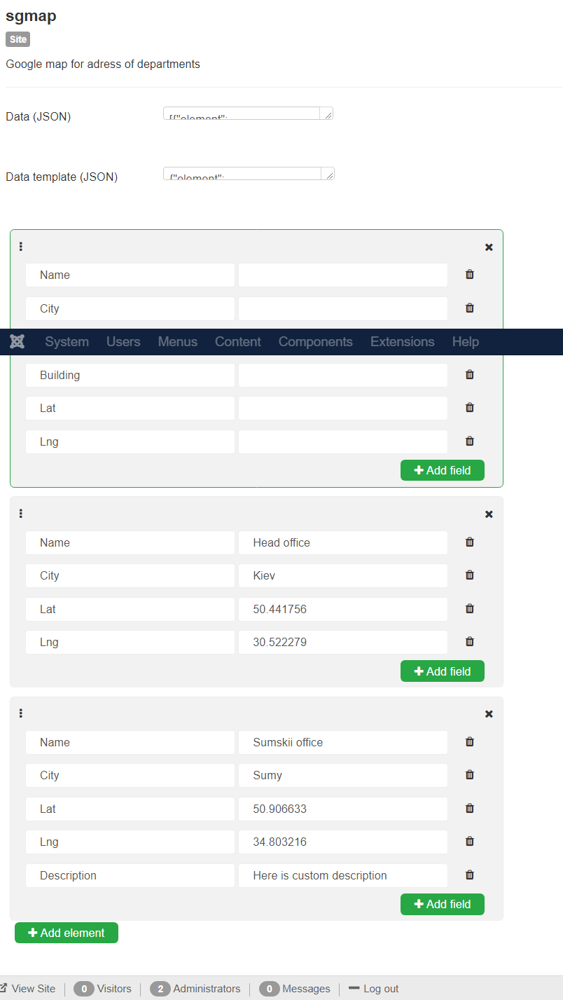
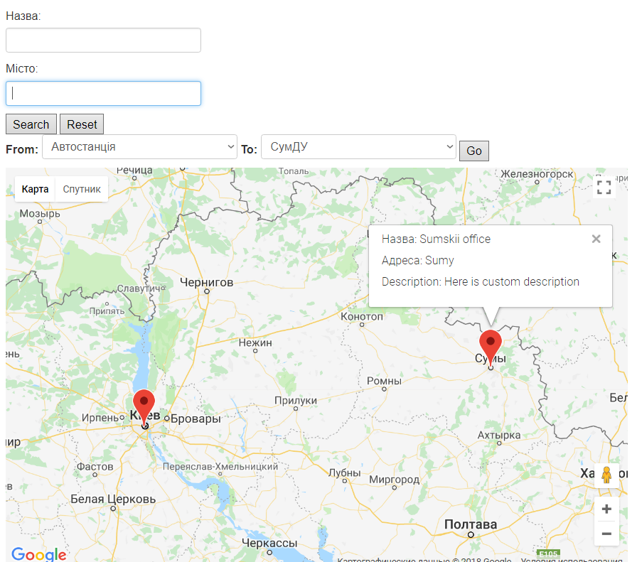

# sgmap
Map module for CMS Joomla. It allow you to mark the places on the map and add custom descriptions on it.

You can create your own template, add and delete so many fields and items as you want, 
drag and drop list items to control your own hierarchy.

 

And it will looks like this on your site:

 
To install module download project as .zip file and install it from your Joomla CMS by uploading package file.
